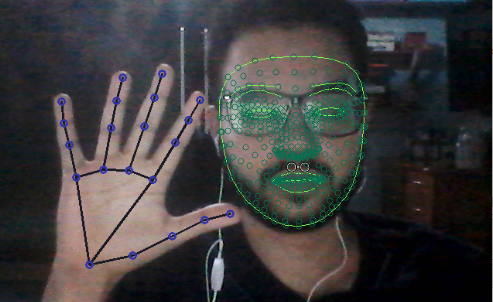

# Assistente Pessoal

 

Um assistente pessoal aplicando reconhecimento de movimentos e de fala, veja os requisitos abaixo.

Por enquanto ele é capaz de:
* Ouvir o usuário ao colocar a mão na orelha. Pedidos compatíveis no modo escuta:
  *Abrir Youtube
  *Abrir um jogo
  *Abrir globo esporte
* Reconhecer sinal de "Ok" --> ao reconhecer ele vai abrir o youtube

### Requisitos:
* Bibliotecas utilizadas: [MEDIAPIPE](https://google.github.io/mediapipe/), [OPENCV](https://pypi.org/project/opencv-python/), [WEBBROWSER](https://pypi.org/project/pycopy-webbrowser/), [OS](https://pypi.org/project/os-win/), [TIME](https://pypi.org/project/times/) e [DATETIME](https://pypi.org/project/DateTime/)
